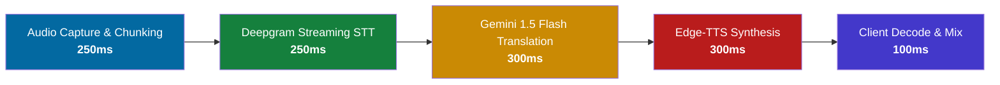
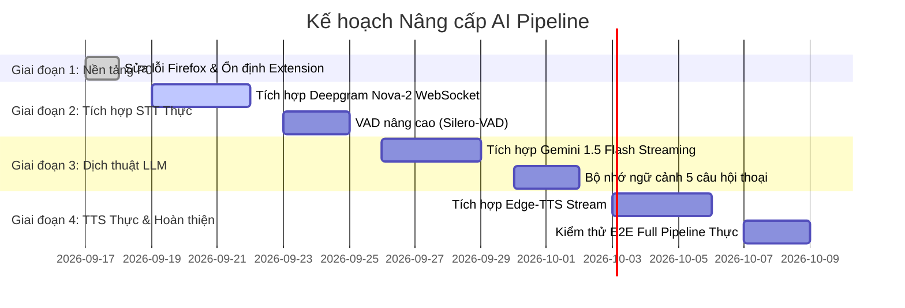

# Phân tích Khoảng cách AI Pipeline: Mock vs Real Production (AI Pipeline Gap Analysis)

**Dự án:** VietDub AI — Real-time Vietnamese Dubbing Extension  
**Mục tiêu:** Đánh giá hiện trạng pipeline giả lập (Mock Pipeline), phân tích khoảng cách kỹ thuật với các giải pháp AI thực tế, và xây dựng lộ trình nâng cấp đạt mục tiêu độ trễ (< 1.5s) và chi phí (< $0.50/giờ).  
**Ngày lập:** 17/09/2026  

---

## 1. Bảng So sánh Tổng hợp: Mock vs Real AI Services (Mục 9.1)

### 1.1. Speech-to-Text (STT)

| Giải pháp | Cơ chế hoạt động | Độ trễ (Latency) | Chi phí / Giờ | Hỗ trợ Streaming | Độ chính xác & Tiếng ồn |
| :--- | :--- | :--- | :--- | :--- | :--- |
| **MockSTTProvider** *(Hiện tại)* | Mảng câu mẫu cố định kết hợp mô phỏng trễ | ~100ms | $0.00 | Giả lập qua VAD | Không áp dụng (luôn trả về mẫu) |
| **Deepgram Nova-2** *(Đề xuất chính)* | Websocket Streaming, audio chunk 100-250ms | 150 - 300ms | ~$0.26 / giờ | Rất mạnh (native WS) | Rất cao với tiếng Anh chuyên ngành, podcast |
| **Whisper Live (Self-hosted)** | Faster-Whisper chạy trên GPU local (RTX 3060+) | 300 - 600ms | $0.00 (tốn điện/GPU) | Cần quản lý buffer | Cao, nhưng phụ thuộc cấu hình phần cứng người dùng |
| **Google Cloud STT (v2)** | gRPC streaming recognition | 350 - 500ms | ~$0.96 / giờ | Có (gRPC) | Tốt, nhưng chi phí cao hơn mục tiêu ngân sách |

### 1.2. Dịch thuật theo Ngữ cảnh (Translation Engine)

| Giải pháp | Mô hình / Công nghệ | Độ trễ (Latency) | Chi phí / 1 Giờ hội thoại (~9,000 từ) | Khả năng duy trì ngữ cảnh | Hỗ trợ Streaming Tokens |
| :--- | :--- | :--- | :--- | :--- | :--- |
| **Mock TranslationEngine** *(Hiện tại)* | Bảng từ điển ánh xạ (Rule-based dictionary) | ~10ms | $0.00 | Không có ngữ cảnh liên tục | Không |
| **Google Gemini 1.5 Flash** *(Đề xuất chính)* | LLM streaming API với system prompt chuyên biệt | 200 - 400ms | ~$0.015 / giờ ($0.075/1M in, $0.30/1M out) | Xuất sắc (cung cấp 5 câu trước làm context window) | Có (Server-Sent Events / Stream) |
| **GPT-4o-mini** | LLM streaming API | 250 - 450ms | ~$0.035 / giờ | Rất tốt | Có |
| **DeepL API (Pro)** | Chuyên biệt Machine Translation | 150 - 250ms | ~$0.18 / giờ | Trung bình (câu đơn lẻ, ít ngữ cảnh hội thoại) | Không có streaming từng từ |

### 1.3. Tổng hợp Giọng nói Tiếng Việt (Vietnamese TTS)

| Giải pháp | Loại mô hình | Độ trễ (Latency) | Chi phí / Giờ | Độ tự nhiên giọng đọc | Hỗ trợ Chunk Streaming |
| :--- | :--- | :--- | :--- | :--- | :--- |
| **Mock VietnameseTTSEngine** *(Hiện tại)* | Tạo sóng âm Sine giả lập và đóng gói Base64 | ~15ms | $0.00 | Âm thanh thô giả lập | Có |
| **Edge-TTS (Microsoft Neural)** *(Đề xuất ưu tiên)* | Giọng đọc `vi-VN-HoaiMyNeural` hoặc `vi-VN-NamMinhNeural` | 200 - 350ms | $0.00 (sử dụng endpoint công khai) | Rất tự nhiên, chuẩn ngữ điệu Bắc/Nam | Có (truyền stream MP3/PCM) |
| **Kokoro-82M (ONNX Local)** | Mô hình TTS cục bộ 82M tham số | 150 - 250ms | $0.00 (chạy on-device trên máy người dùng) | Tương đối tốt, đang hoàn thiện tiếng Việt | Có |
| **ElevenLabs (Turbo v2.5)** | Generative Voice AI cao cấp | 300 - 500ms | ~$3.00 - $5.00 / giờ | Đỉnh cao, truyền cảm | Có |

---

## 2. Phân tích Cân bằng giữa Chất lượng và Độ trễ (Mục 9.3)

### 2.1. Mục tiêu Ngân sách Độ trễ (< 1.500ms tổng chu trình)



$$\text{Tổng độ trễ dự kiến} = 250\text{ms} + 250\text{ms} + 300\text{ms} + 300\text{ms} + 100\text{ms} = 1.200\text{ms} \quad (\le 1.500\text{ms})$$

### 2.2. Mục tiêu Ngân sách Chi phí (< $0.50 / giờ)
- **STT (Deepgram Nova-2):** $0.26 / giờ
- **Dịch thuật (Gemini 1.5 Flash):** ~$0.02 / giờ
- **TTS (Edge-TTS Neural):** $0.00 / giờ
- **Tổng chi phí vận hành:** $\approx \$0.28\text{ / giờ} < \$0.50\text{ / giờ}$ (Đạt và vượt chỉ tiêu tiết kiệm).

---

## 3. Lộ trình Chuyển đổi (Migration Roadmap) (Mục 9.2)



### 3.1. Cấu hình & Biến Môi trường yêu cầu khi triển khai

Tạo tệp `.env.production` cho backend:
```bash
# Deepgram Streaming STT
DEEPGRAM_API_KEY=your_deepgram_api_key_here
STT_PROVIDER=deepgram # hoặc 'whisper_live'

# Google Gemini Translation
GEMINI_API_KEY=your_gemini_api_key_here
TRANSLATION_MODEL=gemini-1.5-flash

# Vietnamese TTS
TTS_PROVIDER=edge_tts # hoặc 'kokoro_onnx'
EDGE_TTS_VOICE=vi-VN-HoaiMyNeural

# Quản lý giới hạn an toàn
BUDGET_MAX_COST_PER_SESSION_USD=0.50
RATE_LIMIT_CHUNKS_PER_SECOND=10
```

### 3.2. Chiến lược Dự phòng (Fallback Strategy)
1. **Khi Deepgram quá tải hoặc mất mạng:**
   - Tự động chuyển tiếp luồng âm thanh sang Whisper.cpp / Whisper-WebGPU nếu máy người dùng có WebGPU, hoặc trả mã lỗi thân thiện cho client.
2. **Khi Gemini API chạm hạn mức Rate Limit (429):**
   - Fallback ngay sang `gpt-4o-mini` hoặc mô hình dịch offline nhỏ gọn.
3. **Khi TTS không thể kết nối:**
   - Hệ thống tự động hạ cấp chế độ từ `dubbing_and_subtitle` về `subtitle_only`, thông báo cho người dùng trên popup rằng âm thanh thuyết minh tạm thời gián đoạn nhưng phụ đề tiếng Việt vẫn tiếp tục hiển thị không ngắt quãng.
